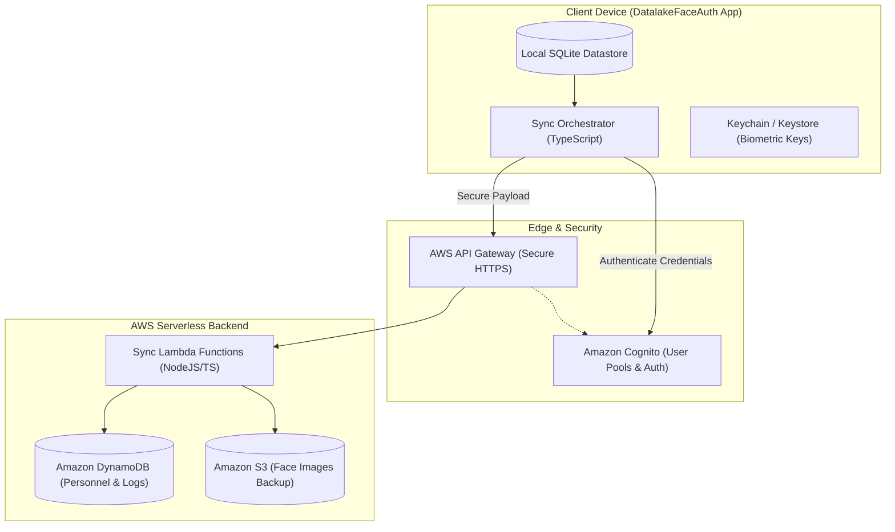
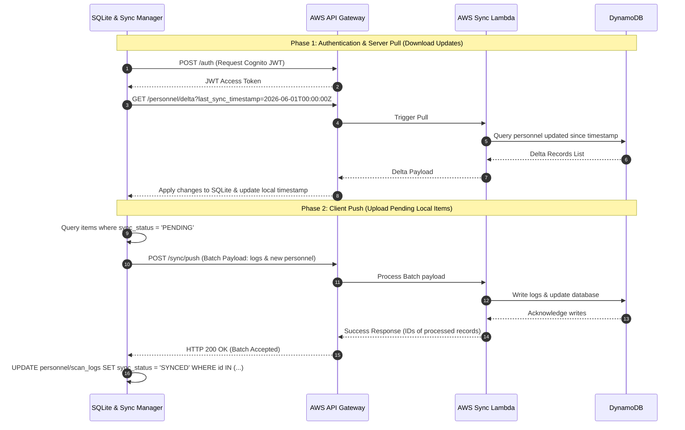

# AWS Offline-First Synchronization Architecture

This document describes the offline-first synchronization architecture for **DatalakeFaceAuth**. Since NHAI field personnel operate in remote, low-connectivity zones, the application is designed to be fully functional offline, queuing transactions locally and syncing with AWS as soon as a network connection becomes available.

---

## 1. System Architecture

The cloud synchronisation architecture comprises a RESTful API built on serverless AWS technologies, allowing safe bidirectional replication.

---

## 2. SQLite Database Schema & States

To track data states for offline operations, both tables (`personnel` and `scan_logs`) utilize a `sync_status` column containing one of three values:
- `PENDING`: Created locally in offline mode, needs to be pushed to AWS.
- `SYNCED`: Replicated successfully to AWS.
- `FAILED`: Replication attempted but failed with structural errors (requires admin inspection).

---

## 3. Data Synchronization Workflow

Replication operates on a **Pull-then-Push** sequence to resolve conflict states before uploads occur.

---

## 4. Key Design Considerations

### A. Conflict Resolution (Last-Write-Wins with Client Master)
- **Personnel Updates**: Personnel data is primarily managed from a central dashboard. If changes occur on both the mobile terminal and the central server, a **Last-Write-Wins (LWW)** strategy using the field `updated_at` determines the final state.
- **Verification Logs**: Verification logs are strictly append-only. There are no edits or updates on logs, preventing conflicts.

### B. Network Resiliency & Backoff
- Sync attempts are triggered by network connection state changes (using `NetInfo` libraries) and schedule timers.
- If a sync request fails due to network dropouts or timeouts (e.g., HTTP 5xx or connection timeout), the app schedules a retry using **Exponential Backoff with Jitter**:
  $$t_{retry} = 2^{attempt} \times 1000\text{ms} + \text{Random Jitter}$$
- This prevents overloading the API Gateway when connectivity returns.

### C. Security & Data Protection
- **Transit Security**: All payloads are sent over TLS 1.3 HTTPS. Requests must contain a signed Cognito JWT token in the `Authorization` header.
- **At-Rest Encryption**:
  - The SQLite file on the device is encrypted using **SQLCipher** (optional in RN, but highly recommended for government projects).
  - The TFLite embeddings stored in SQLite are mathematical representations (128-dimensional float arrays) from which the original face image *cannot* be reconstructed, fulfilling privacy compliance under biometric protection acts.
- **Biometric Templates**: Raw face photos are processed in memory and *discarded immediately* after embedding generation. They are never saved locally unless backing up to S3 is explicitly enabled by the administrator.

### D. Serverless Sizing & Throttling
- **API Gateway Throttling**: Configured with a token bucket algorithm (10,000 requests/sec limit) to prevent DDoS.
- **DynamoDB Auto-Scaling**: Tables utilize On-Demand capacity modes to handle traffic spikes when personnel shift rotations occur.
